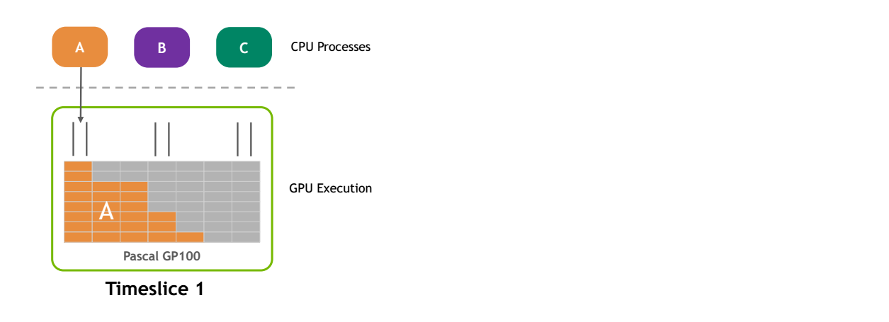
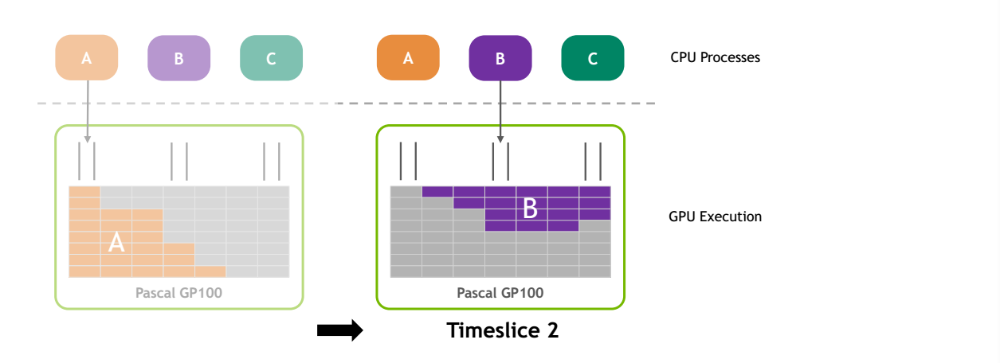
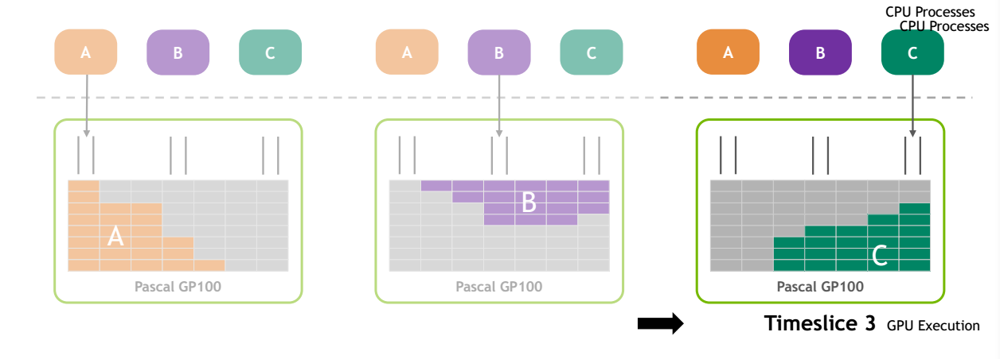
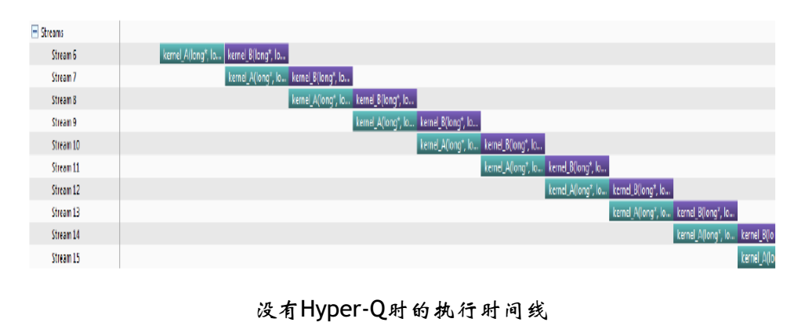
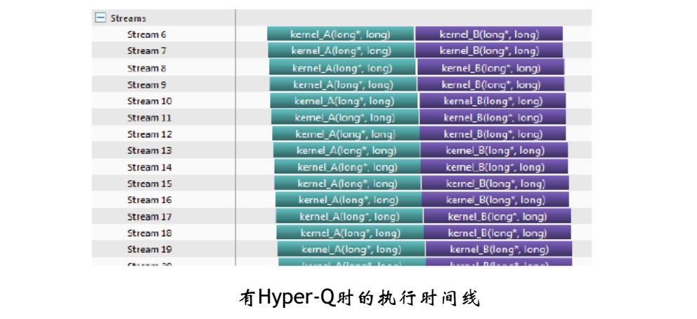
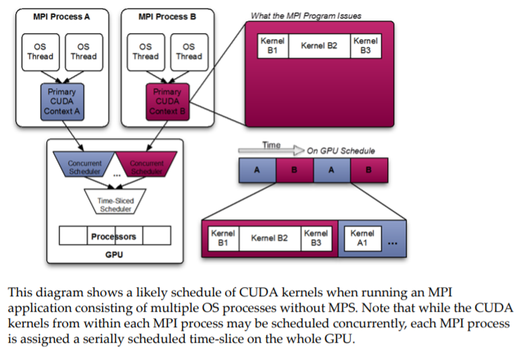
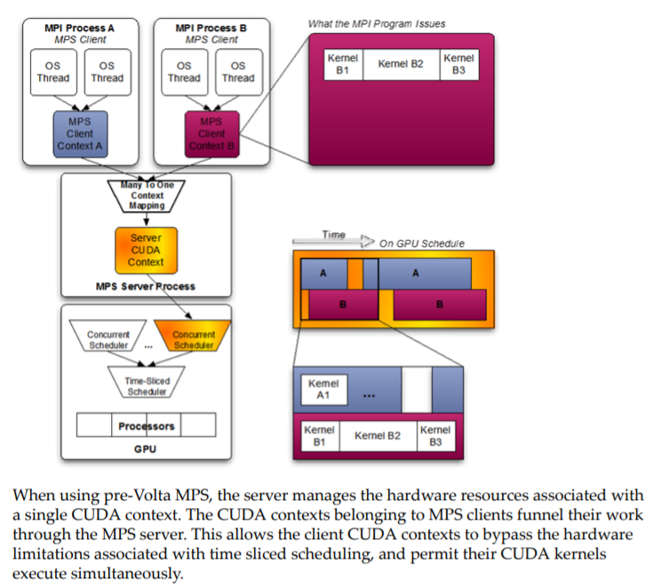
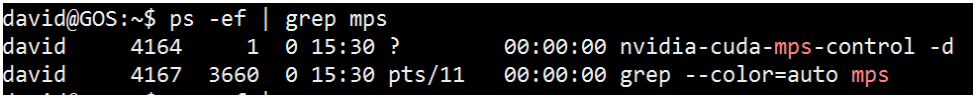
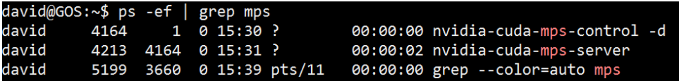
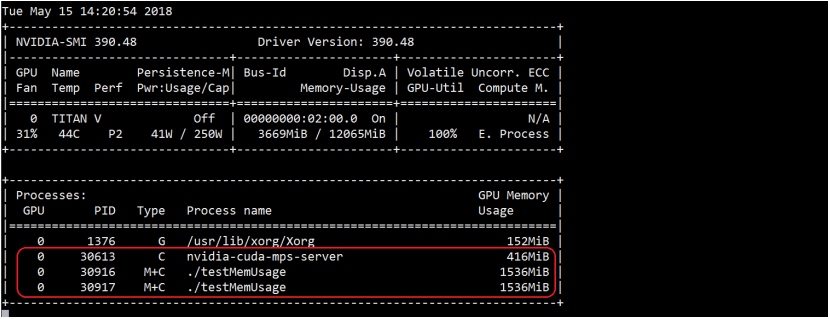

# CUDA多进程服务MPS


<!--more-->

> Reference:
>
> [Hyper-Q Example](https://developer.download.nvidia.cn/compute/DevZone/C/html_x64/6_Advanced/simpleHyperQ/doc/HyperQ.pdf)
>
> [MULTI-PROCESS SERVICE](https://docs.nvidia.com/deploy/pdf/CUDA_Multi_Process_Service_Overview.pdf)
>
> [IMPROVING GPU UTILIZATION WITH MULTI-PROCESS SERVICE (MPS)](http://on-demand.gputechconf.com/gtc/2015/presentation/S5584-Priyanka-Sah.pdf)
>
> [多个docker容器如何共享GPU](https://blog.csdn.net/beckham999221/article/details/85257137)
>
> [基于Volta MPS执行资源配置下的多容器共享GPU性能测试](https://blog.csdn.net/beckham999221/article/details/86644970)
>
> [MPS](https://docs.nvidia.com/deploy/mps/index.html)
>
> 


### 1. CUDA context

- 类似于CPU进程上下文,表示与特定进程关联的所有**状态**
  - 从CPU端分配的GPU上的Global memory (cudaMalloc/cudaMallocManaged)
  - Kernel函数中定义和分配的堆栈空间，例如local memory
  - CUDA streams / events 对象
  - 代码模块(*.cubin, *.ptx)
- 不同的进程有自己的CUDA context
- 每个context有自己的地址空间，并且不能访问其他CUDA context的地址空间







时间片轮转调度,相当于串行执行,每个时刻只有一个进程在GPU上执行,吞吐率不会发生变化,而且由于上下文context切换的开销,延迟增加的同时,吞吐量反而是下降的.


### 2. Hyper-Q (Hyper Queue)

- 允许多个CPU 线程或进程同时加载任务到一个GPU上,实现CUDA kernels的**并发执行** –- 硬件特性

- 支持的连接类型

  - Multi cuda streams
  - Multi cpu threads
  - Multi cpu processes——MPS

- 管理可并发的最大连接数

  ```
  # (默认是8)
  CUDA_DEVICE_MAX_CONNECTIONS = 32 
  ```

- 好处

  - 增加GPU利用率（utilization）和占用率（occupancy）
  - 减少CPU空闲时间
  - 增加吞吐率并减少延

- 使用限制

  - 当kernel A正在执行时, 只有当GPU上任意SM上**有足够的资源**( 寄存器, 共享内存, 线程块槽位等等)来执行kernel B中的1个线程块时， kernel B才会被发射
  - 要求**GPU计算能力大于等于3.5**
  - 最大连接数限制： 32

- 示例代码

  ```
  $CUDA_PATH/samples/6_Advanced/simpleHyperQ
  ```

  




### 3. MPS - Multi-Process Service，多进程服务

- 什么是MPS

  - 一组可替换的，二进制兼容的CUDA API实现，包括：守护进程,服务进程,用户运行时
  - 利用GPU上的Hyper-Q 能力
    - 允许多个CPU进程**共享同一GPU context**
    - 允许不同进程的kernel和memcpy操作在同一GPU上并发执行，以实现最大化
      GPU利用率.

  

  

- 好处

  - 提升GPU利用率（时间上）和占用率（空间上）
  - 减少GPU上下文切换时间
  - 减少GPU上下文存储空

  

- 使用限制

  - 操作系统: 仅支持linux
  - GPU版本： 大于等于CC 3.5
  - CUDA版本：大于等于5.5
  - 最大用户连接数量：
    - Pascal及之前GPU: 16
    - Volta及之后GPU: 48

- 启动

  - 设置GPU compute mode 为 exclusive mode (非必须，但推荐设置)

    ```shell
    sudo nvidia-smi -i 0 -c EXCLUSIVE_PROCESS
    ```

    

  -  启动MPS 守护进程

    ```shell
    # 指定要启动MPS的GPU,不指定默认对所有GPU生效
    export CUDA_VISIBLE_DEVICES=0
    
    # cuda 7.0 以后非必须
    export CUDA_MPS_PIPE_DIRECTORY=/tmp/nvidia-mps 
    
    # cuda 7.0 以后非必须
    export CUDA_MPS_LOG_DIRECTORY=/tmp/nvidia-log 
    
    nvidia-cuda-mps-control –d
    ```

    

  - 查看MPS 守护进程是否正在运行

    ```shell
    ps -ef | grep mps
    ```

    

  - 运行应用程序

    ```shell
    mpirun –np 4 ./test
    ```

    应用程序运行前:

    

    应用程序运行后:

    

    

- 停止

  ```shell
  echo quit | nvidia-cuda-mps-control
  sudo nvidia-smi -i 0 -c 0
  ```

  

- 监视

  ```shell
  nvidia-smi
  ```

  

  

- 分析

  ```shell
   nvprof --profile-all-processes -o output.%p
   mpirun –np 4 ./test
  ```


