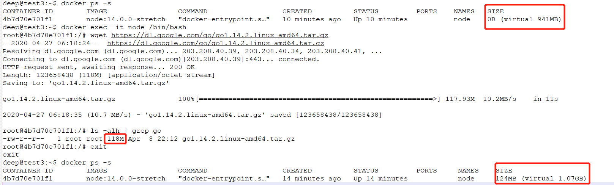

# Docker Storage Driver


<!--more-->

### 参考

> https://docs.docker.com/storage/storagedriver/
>
> https://docs.docker.com/storage/storagedriver/device-mapper-driver/
>
> [Docker修改空间大小](https://blog.51cto.com/6226001001/1952804)
>
> [Docker 环境 Storage Pool 用完解决方案：resize-device-mapper](https://segmentfault.com/a/1190000002931564)
>
> [关于docker动态扩展容器空间大小](https://www.jianshu.com/p/018a4eb79f1d)
>
> dmsetup


## 1. Storage Driver

storage driver 可以让我们在 container 的可写层中创建数据,当删除 container后,这些数据不会保留;而且可写层的读写速度低于原生文件系统;


### 1.1 images / layers

images由一系列的layer组成;

images的每一层代表Dockerfile中的一条指令;


对运行中的container所做的所有更改都会写入 Thin R/W layer;


### 1.2 container / layers

每个container都有自己的container layer, 并且所有更改都在container layer,所以多个容器可以共享对同一基础image的访问,但有自己的数据状态;


Storage Driver 用来管理image layers 和 container layer;

docker 提供了多种Storage driver, 每种Storage driver 对实现的处理方式不同,但是都使用可堆叠(stackable)的image layer和写时复制(CoW)策略;


### 1.3 container size on disk

查看container size

```bash
docker ps -s
```


```bash
#docker pull node:14.0.0-stretch
docker pull node:13.13.0-alpine3.11

#docker run -it -d --name node node:14.0.0-stretch
docker run -it -d --name node node:13.13.0-alpine3.11

docker run -it -d --name node_v -v /home/deepbay/deepops/:/deepops node:14.0.0-stretch
```


```bash
deep@test3:~$ docker ps -s
CONTAINER ID        IMAGE                 COMMAND                  CREATED             STATUS              PORTS               NAMES               SIZE
4b7d70e701f1        node:14.0.0-stretch   "docker-entrypoint.s…"   10 minutes ago      Up 10 minutes                           node                0B (virtual 941MB)
deep@test3:~$ docker exec -it node /bin/bash
root@4b7d70e701f1:/# wget https://dl.google.com/go/go1.14.2.linux-amd64.tar.gz
--2020-04-27 06:18:24--  https://dl.google.com/go/go1.14.2.linux-amd64.tar.gz
Resolving dl.google.com (dl.google.com)... 203.208.40.39, 203.208.40.34, 203.208.40.41, ...
Connecting to dl.google.com (dl.google.com)|203.208.40.39|:443... connected.
HTTP request sent, awaiting response... 200 OK
Length: 123658438 (118M) [application/octet-stream]
Saving to: 'go1.14.2.linux-amd64.tar.gz'

go1.14.2.linux-amd64.tar.gz               100%[====================================================================================>] 117.93M  10.2MB/s    in 11s     

2020-04-27 06:18:35 (10.7 MB/s) - 'go1.14.2.linux-amd64.tar.gz' saved [123658438/123658438]

root@4b7d70e701f1:/# ls -alh | grep go
-rw-r--r--   1 root root 118M Apr  8 22:12 go1.14.2.linux-amd64.tar.gz
root@4b7d70e701f1:/# exit
exit
deep@test3:~$ docker ps -s
CONTAINER ID        IMAGE                 COMMAND                  CREATED             STATUS              PORTS               NAMES               SIZE
4b7d70e701f1        node:14.0.0-stretch   "docker-entrypoint.s…"   14 minutes ago      Up 14 minutes                           node                124MB (virtual 1.07GB)

```

在容器内下载golang安装包,docker container size 增加;




- `size`:  container layer 的数据量
- `virtual size`:  image layers加上 container layer的数据量


### 1.4 选择 storage driver

> https://docs.docker.com/storage/storagedriver/select-storage-driver/

- overlay2
- aufs
- devicemapper
- btrfs
- zfs
- vfs


## 2. Device Mapper

### 2.1 设置storage driver为device mapper 

> centos 7

```sh
sudo yum install -y yum-utils

sudo yum-config-manager \
    --add-repo \
    https://download.docker.com/linux/centos/docker-ce.repo
    
yum list docker-ce --showduplicates | sort -r

sudo yum install docker-ce-18.03.1.ce docker-ce-cli-18.03.1.ce containerd.io

sudo tee /etc/docker/daemon.json <<-'EOF'
{
	"registry-mirrors": ["https://registry.docker-cn.com"],
	"storage-driver": "devicemapper"
}y
EOF

sudo systemctl daemon-reload
sudo systemctl restart docker

# start up automatically on boot up
sudo systemctl enable docker && sudo systemctl start docker


```


```sh
sudo groupadd docker
sudo gpasswd -a sunyh docker
sudo service docker restart

reboot
```


### 2.2 设置 docker Pool Data Space

```bash
DATA_SIZE=1000
METADATA_SIZE=10
sudo systemctl stop docker
dd if=/dev/zero of=/var/lib/docker/devicemapper/devicemapper/data bs=1G count=0 seek=$DATA_SIZE
dd if=/dev/zero of=/var/lib/docker/devicemapper/devicemapper/metadata bs=1G count=0 seek=$METADATA_SIZE
sudo systemctl start docker

```


### 2.3 设置 docker device size (container size)

```bash
docker pull node:13.13.0-alpine3.11
docker run -it -d --name node node:13.13.0-alpine3.11
```


```sh
docker ps -s
dmsetup table
```


resize container 

```sh
echo $((30*1024*1024*1024/512))

echo 0 41943040 thin 253:0 7 | sudo dmsetup load docker-8:2-101407194-f69fd6ac662db4fd50e56ad2d4d45987bf31ade7b0b17a2e9d29b333df98c76a

sudo dmsetup resume docker-8:2-101407194-f69fd6ac662db4fd50e56ad2d4d45987bf31ade7b0b17a2e9d29b333df98c76a

sudo xfs_growfs -d /dev/mapper/docker-8:2-101407194-f69fd6ac662db4fd50e56ad2d4d45987bf31ade7b0b17a2e9d29b333df98c76a

```


脚本简化以上流程:

1. 获取deviceName

   ```sh
   # docker inspect -f '{{ .GraphDriver.Data.DeviceName }}' [container id]
   
   docker inspect -f '{{ .GraphDriver.Data.DeviceName }}' 2d9ddb14b348
   ```

   

2. 使用`dmsetup table` 命令显示出device mapper的具体信息

   ```sh
   # dmsetup table [device name]
   sudo dmsetup table docker-8:2-101407194-f69fd6ac662db4fd50e56ad2d4d45987bf31ade7b0b17a2e9d29b333df98c76a
   ```

   > 当容器在stop状态时以上操作得不到device mapper信息，虽然由于空
   > 间不足不能启动成功，但需要先docker start <CONTAINER ID> 才能查找到对应
   > device mapper信息。

3. 算出想要扩容的扇区数

   ```sh
   SIZE=15
   echo $(($SIZE*1024*1024*1024/512))
   ```

   

4. load一个新的设备信息表(新表与旧表相比只修改扇区数量)

   ```sh
   echo 0 31457280 thin 253:0 7 | sudo dmsetup load docker-8:2-101407194-f69fd6ac662db4fd50e56ad2d4d45987bf31ade7b0b17a2e9d29b333df98c76a
   
   ```

   

5. 通过`dmsetup resume`激活新的设备信息表

   ```sh
   sudo dmsetup resume docker-8:2-101407194-f69fd6ac662db4fd50e56ad2d4d45987bf31ade7b0b17a2e9d29b333df98c76a
   
   ```

   

6. 调整文件系统大小(只能增,不能减)

   | File Type   | Resize CLI |
   | ----------- | ---------- |
   | xfs         | xfs_growfs |
   | ex2,ex3,ex4 | resize2fs  |

   

   ```sh
   sudo xfs_growfs -d /dev/mapper/docker-8:2-101407194-f69fd6ac662db4fd50e56ad2d4d45987bf31ade7b0b17a2e9d29b333df98c76a
   
   ```


```python
import paramiko

hostname = '192.168.232.133'
username = 'sunyh'
password = 'hisunyh'
container_id = "3afd866418592636fc27754bfebdf29576daa5c22118e323a912320571dcabc0"
device_size = 16
paramiko.util.log_to_file('syslogin.log')  # 发送paramiko日志到syslogin.log文件


def resize_container():
    ssh = paramiko.SSHClient()
    # 获取客户端host_keys,默认~/.ssh/known_hosts,非默认路径需指定ssh.load_system_host_keys(/xxx/xxx)
    ssh.load_system_host_keys()
    ssh.connect(hostname=hostname, username=username, password=password)
    # echo "yourpasswd" |sudo -S yourcommand
    stdin, stdout, stderr = ssh.exec_command("docker inspect -f '{{ .GraphDriver.Data.DeviceName }}' %s" % container_id)
    # print(stdout.read().decode('utf-8'))
    device_name = stdout.readlines()[0]
    if device_name.find('docker') == -1:
        print('get device name failed')
        return
    print('device name: %s' % device_name)

    stdin, stdout, stderr = ssh.exec_command("echo %s | sudo -S dmsetup table %s" % (password, device_name))
    device_mapper = stdout.readlines()[0]
    if device_mapper.find('thin') == -1:
        print('get device mapper info failed')
        return
    print('device mapper info: %s' % device_mapper)

    device_sector = device_mapper.replace('\n', '').split('thin')[1]
    print('device sector: %s' % device_sector)

    stdin, stdout, stderr = ssh.exec_command('echo 0 %s thin%s | sudo dmsetup load %s' % (device_size * 1024 * 1024 * 1024 / 512, device_sector, device_name))
    print('dmsetup load finish')

    stdin, stdout, stderr = ssh.exec_command('sudo dmsetup resume %s' % device_name)
    print('dmsetup resume finish')

    fs_line = 'sudo xfs_growfs -d /dev/mapper/%s' % device_name
    print(fs_line)
    stdin, stdout, stderr = ssh.exec_command(fs_line)
    print(stdout.readlines())
    print('file system modify finish')
    ssh.close()
    pass

if __name__ == "__main__":
    resize_container()

```


