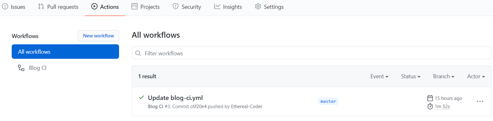

# Github Action


github action + hugo / vuepress + github pages / gitee pages  自动构建发布

<!--more-->


### GitHub pages + hugo

新建两个仓库分别用于开发和部署(可用同一仓库)

```bash
# example

# dev repo -> sunnyh1220/docsgo
# deploy repo -> sunnyh1220/posts (可选sunnyh1220.github.io 或 sunnyh1220/xxx的gh-pages分支 )
```


Deploy keys && Secrets

```shell
ssh-keygen -t rsa -b 4096 -C "$(git config user.email)" -f gh-pages -N ""
# You will get 2 files:
#   gh-pages.pub (public key)
#   gh-pages     (private key)
```


部署仓库设置Deploy keys: Settings -> Deploy keys, 添加公钥, `Allow write access`勾上;


开发仓库设置Secrets: Setting -> Secrets, 添加私钥, name为 `ACTIONS_DEPLOY_KEY`;


在开发仓库以下路径新建GitHub Actions部署脚本文件: `.github/workflow/hugo-ci.yml
```yaml
name: GitHub Pages

on:
  push:
    branches:
      - main  # Set a branch to deploy
  pull_request:

jobs:
  deploy:
    runs-on: ubuntu-20.04
    concurrency:
      group: ${{ github.workflow }}-${{ github.ref }}
    steps:
      - uses: actions/checkout@v2
        with:
          submodules: true  # Fetch Hugo themes (true OR recursive)
          fetch-depth: 0    # Fetch all history for .GitInfo and .Lastmod

      - name: Setup Hugo
        uses: peaceiris/actions-hugo@v2
        with:
          hugo-version: '0.89.4'
          extended: true

      - name: Build
        run: hugo --minify

      - name: Deploy
        uses: peaceiris/actions-gh-pages@v3
        if: ${{ github.ref == 'refs/heads/main' }}
        with:
          deploy_key: ${{ secrets.ACTIONS_DEPLOY_KEY }}
          external_repository: sunnyh1220/posts  # github username
          publish_branch: gh-pages
          publish_dir: ./public

```


hugo配置

```toml
# config.toml

# 站点配置
baseURL = "https://sunnyh1220.github.io/posts" # 或 https://sunnyh1220.github.io
```


开发仓库提交后就会自动构建部署.




### GitHub pages + vuepress

仓库配置同上

VuePress配置
```js
// .vuepress/config.js
module.exports = {
	base: '/posts/'  // repository name
}
```

GitHub Actions脚本文件 `.github/workflow/vuepress-ci.yml
```yaml
# This is a basic workflow to help you get started with Actions

name: Blog CI

# Controls when the action will run. 
on:
  # Triggers the workflow on push or pull request events but only for the master branch
  push:
    branches: [ master ]

  # Allows you to run this workflow manually from the Actions tab
  workflow_dispatch:

# A workflow run is made up of one or more jobs that can run sequentially or in parallel
jobs:
  # This workflow contains a single job called "build"
  build:
    # The type of runner that the job will run on
    runs-on: ubuntu-latest

    # Steps represent a sequence of tasks that will be executed as part of the job
    steps:
      # Checks-out your repository under $GITHUB_WORKSPACE, so your job can access it
      - uses: actions/checkout@v2

      # Runs a set of commands using the runners shell
      - name: Blog building
        run: |
          yarn install
          yarn docs:build
          
      - name: Blog Deploy
        uses: peaceiris/actions-gh-pages@v2.5.1
        env:
          ACTIONS_DEPLOY_KEY: ${{ secrets.ACTIONS_DEPLOY_KEY }}
          EXTERNAL_REPOSITORY: sunnyh1220/posts # github deploy repository, 
          PUBLISH_BRANCH: gh-pages # deploy branch
          PUBLISH_DIR: docs/.vuepress/dist
```


### gitee pages

参考: https://github.com/yanglbme/gitee-pages-action

