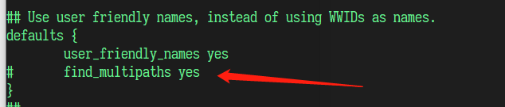
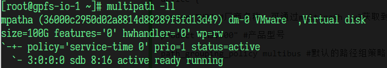
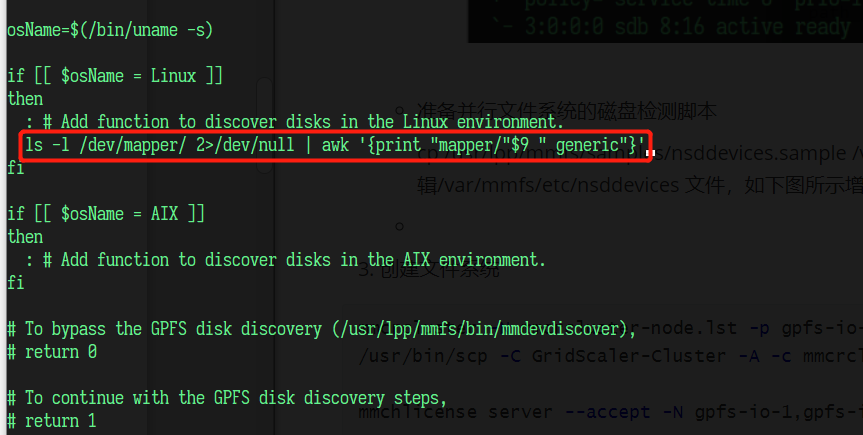
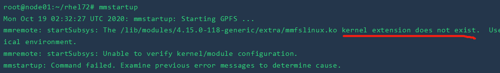

# GPFS安装配置


<!--more-->


## GPFS安装配置

### 1. 操作系统配置

- SELINUX

  修改/etc/selinux/config 文件将 selinux 设置为 disable。

- 防火墙

  使用 systemctl stop firewalld 来关闭防火墙，使用 systemctl disable firewalld 来

  禁用防火墙自动启动服务。

- 软件包

  将软件安装所需的依赖软件包件复制到了`/root/rhel72/`目录中

  ```bash
  # scp -r rhel72 root@192.168.1.48:/root
  ```

  

- 网络配置

  更新服务器`/etc/hosts`

  ```
  # gpfs
  192.168.1.50 gpfs-io-1
  192.168.1.48 gpfs-io-2
  192.168.1.162 gpfs-cli-1
  192.168.1.33 gpfs-cli-2
  192.168.1.29 gpfs-cli-3
  192.168.1.30 gpfs-cli-4
  ```


### 2. I/O 服务器端安装

准备:

- I/O 节点之间以及 I/O 节点与计算节点之间需要设定好 ssh 无密码访问功能。
- I/O 节点与计算节点的主机名以及 IP 地址能够正确解析。

```bash
# 每个节点执行
# 免密
ssh-keygen -t rsa

ssh-copy-id -i ~/.ssh/id_rsa.pub gpfs-io-1
ssh-copy-id -i ~/.ssh/id_rsa.pub gpfs-io-2
ssh-copy-id -i ~/.ssh/id_rsa.pub gpfs-cli-1
ssh-copy-id -i ~/.ssh/id_rsa.pub gpfs-cli-2
```


#### 2.1 软件安装

安装 gpfs rpm 包

```bash
# 基础包
# -ivh 
cd ~/rhel72/4.2.3.22/ && rpm -ivh gpfs.base-4.2.3-22.x86_64.rpm gpfs.docs-4.2.3-22.noarch.rpm gpfs.gpl-4.2.3-22.noarch.rpm gpfs.gskit-8.0.50-86.x86_64.rpm gpfs.msg.en_US-4.2.3-22.noarch.rpm gpfs.ext-4.2.3-22.x86_64.rpm

# 安装升级包
# -Uvh
# cd ~/rhel72/4.2.3.22/ && rpm -Uvh gpfs.base-4.2.3-22.x86_64.rpm gpfs.docs-4.2.3-22.noarch.rpm gpfs.gpl-4.2.3-22.noarch.rpm gpfs.gskit-8.0.50-86.x86_64.rpm gpfs.msg.en_US-4.2.3-22.noarch.rpm gpfs.ext-4.2.3-22.x86_64.rpm

# --force
# cd ~/rhel72/4.2.3.22/ && rpm -Uvh --force gpfs.base-4.2.3-22.x86_64.rpm gpfs.docs-4.2.3-22.noarch.rpm gpfs.gpl-4.2.3-22.noarch.rpm gpfs.gskit-8.0.50-86.x86_64.rpm gpfs.msg.en_US-4.2.3-22.noarch.rpm gpfs.ext-4.2.3-22.x86_64.rpm 

# --------------------
# -----  Ubuntu  -----

# cd ~/rhel72/4.2.3.22/ && dpkg -i gpfs.base_4.2.3-22_amd64.deb gpfs.docs_4.2.3-22_all.deb gpfs.gpl_4.2.3-22_all.deb gpfs.gskit_8.0.50-86_amd64.deb gpfs.msg.en-us_4.2.3-22_all.deb gpfs.ext_4.2.3-22_amd64.deb 

# 卸载
# dpkg -l | grep gpfs
# dpkg -P gpfs.base gpfs.docs gpfs.ext gpfs.gpl gpfs.gskit gpfs.gss.pmcollector gpfs.gss.pmsensors gpfs.java gpfs.msg.en-us
```

编译

```bash
cd /usr/lpp/mmfs/src && make Autoconfig LINUX_DISTRIBUTION=REDHAT_AS_LINUX && make World && make InstallImages
```

如果编译提示没有`kernel-headers`,安装对应的版本的`kernel-headers`

```bash
# yum install -y kernel-headers kernel-devel
cd ~/rhel72/centos7.7-kernel/ && rpm -ivh kernel-headers-3.10.0-1062.el7.x86_64.rpm kernel-devel-3.10.0-1062.el7.x86_64.rpm

yum install -y gcc gcc-c++
```


将gpfs执行文件路径添加到环境变量

```bash
echo 'PATH=$PATH:/usr/lpp/mmfs/bin' >> /etc/profile && source /etc/profile
```


**删除已有集群节点:**

```bash
# https://www.ibm.com/support/knowledgecenter/STXKQY_5.0.0/com.ibm.spectrum.scale.v5r00.doc/bl1pdg_nodnoad.htm

mmdelnode -f
```


#### 2.2 初始化配置文件

1. 创建存储集群

   > 只需在 gpfs-io-1 配置

   创建存储集群需要两个配置文件，一个用于设定服务器的角色(mmcrcluster-node.lst) ， 一 个 用 于 设 定 存 储 集 群 的 参 数 配 置(mmcrcluster-config.lst)，两个文件的内容参考如下：

   ```bash
   tee ~/mmcrcluster-node.lst <<-'EOF'
   gpfs-io-1:manager-quorum
   gpfs-io-2:manager-quorum
   EOF
   
   tee ~/mmcrcluster-config.lst <<-'EOF'
   pagepool 4096M
   maxMBpS 22400
   maxblocksize 16m
   EOF
   ```

   创建集群:

   ```bash
   mmcrcluster -N mmcrcluster-node.lst -p gpfs-io-1 -s gpfs-io-2 -r /usr/bin/ssh -R /usr/bin/scp -C GridScaler-Cluster -A -c mmcrcluster-config.lst
   ```

   为节点添加License:

   ```
   mmchlicense server --accept -N gpfs-io-1,gpfs-io-2
   ```

   

2. .创建 NSD 磁盘

   - Multipath配置

     ```bash
     # http://www.linuxboy.net/linuxjc/144375.html
     yum install -y device-mapper-multipath
     mpathconf --enable
     lsmod |grep dm_multipath
     modprobe dm-multipath
     modprobe dm-round-robin
     service multipathd start
     multipath –v2
     multipath -ll
     ```

     如果`multipath -ll`没输出,编辑配置文件`/etc/multipath.conf`,将`find_multipaths yes` 注释

     ```bash
     vi /etc/multipath.conf
     ```

     

     重启,然后验证是否配置成功

     

     

   - 准备并行文件系统的磁盘检测脚本

     cp /usr/lpp/mmfs/samples/nsddevices.sample /var/mmfs/etc/nsddevices编辑/var/mmfs/etc/nsddevices 文件，如下图所示增加/dev/mapper 一行内容。

     

     ```bash
     cp /usr/lpp/mmfs/samples/nsddevices.sample /var/mmfs/etc/nsddevices && chmod +777 /var/mmfs/etc/nsddevices && vi /var/mmfs/etc/nsddevices
     
     # ls -l /dev/mapper/ 2>/dev/null | awk '{print "mapper/"$9 " generic"}'
     ```

     重启每一台服务器

     ```bash
     init 6
     ```

     

   - 编写 NSD 磁盘脚本

     ```bash
     tee ~/nsd.conf <<-'EOF'
     %nsd: nsd=NSD_1
     device=/dev/mapper/mpathb
     servers=gpfs-io-1,gpfs-io-2
     usage=dataAndMetadata
     failureGroup=100
     pool=system
     EOF
     ```

     servers 为该 LUN 被访问的 I/O 服务器顺序，当 gpfs-io-1 服务器关机或宕机时，gpfs-io-2 优先取得该 LUN 的控制权.

     

   - 创建 NSD 磁盘

     ```bash
     # 创建 NSD 磁盘
     mmcrnsd -F nsd.conf
     
     # 删除 NSD 磁盘
     # mmdelnsd -F nsd.conf
     ```

     创建磁盘过程出现错误: `refers to an existing NSD`, 加上 `-v no`:

     参考:https://www.ibm.com/support/knowledgecenter/STXKQY_4.2.3/com.ibm.spectrum.scale.v4r23.doc/bl1adm_mmcrnsd.htm

     ```bash
     mmcrnsd -F -v no nsd.conf
     ```

     

3. 创建文件系统

   ```bash
   # 创建文件系统
   mmcrfs gpfs -F nsd.conf -m 1 -M 2 -r 1 -R 2 -A yes -B 16m -n 512 -j cluster -Q yes -T /gpfs
   
   # 查看文件系统
   mmlsfs all
   ```

   上述命令中 gpfs 为文件系统名称，-A yes 代表文件系统自动 mount，-B 16m 代表文件系统块大小为 16m，-n 512 代表该集群最大支持节点数，-j cluster 代表存储工作方式为集群方式，-Q yes 代表打开磁盘配额管理功能，-T /gpfs 代表文件系统在 Linux 平台的 mount 点为/gpfs。


### 3. Linux 计算节点客户端安装

准备:

- I/O 节点之间以及 I/O 节点与计算节点之间需要设定好 ssh 无密码访问功能。

  ```shell
  # io node
  ssh-keygen -t rsa   
  ssh-copy-id -i ~/.ssh/id_rsa.pub -p 22 root@192.168.1.29
  ssh-copy-id -i ~/.ssh/id_rsa.pub -p 22 root@192.168.1.30
  ```

  

- I/O 节点与计算节点的主机名以及 IP 地址能够正确解析。

- 关闭计算节点的防火墙。

- 设置网络


软件安装:

```bash
# centos
cd ~/rhel72/4.2.3.22/ && rpm -Uvh gpfs.base-4.2.3-22.x86_64.rpm gpfs.docs-4.2.3-22.noarch.rpm gpfs.gpl-4.2.3-22.noarch.rpm gpfs.gskit-8.0.50-86.x86_64.rpm gpfs.msg.en_US-4.2.3-22.noarch.rpm gpfs.ext-4.2.3-22.x86_64.rpm

# ubuntu
cd ~/rhel72/4.2.3.22/ && dpkg -i gpfs.base_4.2.3-22_amd64.deb gpfs.docs_4.2.3-22_all.deb gpfs.gpl_4.2.3-22_all.deb gpfs.gskit_8.0.50-86_amd64.deb gpfs.msg.en-us_4.2.3-22_all.deb gpfs.ext_4.2.3-22_amd64.deb 
```

编译:

```bash
cd /usr/lpp/mmfs/src
make Autoconfig LINUX_DISTRIBUTION=REDHAT_AS_LINUX
make World
make InstallImages
```

客户端加到gpfs:

```bash
mmaddnode -N gpfs-cli-1
mmaddnode -N gpfs-cli-2
mmaddnode -N gpfs-cli-3
mmaddnode -N gpfs-cli-4

# 删除节点
# mmdelnode -N gpfs-cli-1

# 删除全部节点
# mmdelnode -a

# 节点与cluster失联,可以在node节点删除
# mmdelnode -f
```


```shell
# if addnode error

sudo apt-get autoremove
sudo apt --fix-broken install
```


客户端添加License:

```bash
mmchlicense client --accept -N gpfs-cli-1
mmchlicense client --accept -N gpfs-cli-2
mmchlicense client --accept -N gpfs-cli-3
mmchlicense client --accept -N gpfs-cli-4
```


## GPFS 常用CLI

#### 并行文件系统服务启动

mmstartup，启动当前服务器的并行文件系统服务；

mmstartup -N node01，启动服务器 node01 的并行文件系统服务；

mmstartup -a，启动所有并行文件系统集群列表中的服务器的并行文件系统服务；

默认并行文件系统的服务进程是随着操作系统启动时自动启动的；


#### 并行文件系统服务的停止

mmshutdown，停止当前服务器的并行文件系统服务；

mmshutdown -N node01，停止服务器 node01 的并行文件系统服务；

mmshutdown -a，停止所有并行文件系统集群列表中的服务器的并行文件系统服务；


#### 查看并行文件系统服务状态

mmgetstate，查看当前服务器的并行文件系统服务状态；

mmgetstate -N node01，查看服务器 node01 的并行文件系统服务状态；

mmgetstate -a，查看所有并行文件系统集群列表中的服务器的并行文件系统服务状态；

通常的状态有 active（正常运行状态），down（服务停止状态），arbitrating（服务已启动，但是正在寻找主管理节点）


#### 手工 mount/umount 文件系统！

通常情况下，并行文件系统服务启动后，文件系统会自动挂载，出于维护或者其他原因，我们可能需要手工 umount 或者手工 mount 文件系统。

mmmount gpfs，在当前服务器上 mount 文件系统；

mmumount gpfs，在当前服务器上 umount 文件系统；

mmmount gpfs -N node01，在 node01 服务器上 mount 文件系统；

mmumount gpfs -N node01，在 node01 服务器上 umount 文件系统；

mmmount gpfs -a，在并行文件系统集群中的所有节点上 mount 文件系统；

mmumount gpfs -a，在并行文件系统集群中的所有节点上 umount 文件系统;


#### 查看文件系统 mount 状态

mmlsmount gpfs -L 查看并列出 gpfs 文件系统在哪些节点 mount 了；

#### 查看并行文件系统集群信息

mmlscluster

#### 查看并行文件系统集群配置信息

mmlsconfig

#### 查看并行文件系统 gpfs 的配置信息

mmlsfs gpfs

#### 查看并行文件系统集群的磁盘信息

mmlsnsd -M 

#### 查看并行文件系统对应的磁盘信息

mmlsdisk gpfs -M 

#### 并行文件系统重要配置文件

/var/mmfs/gen/mmsdrfs

#### 并行文件系统的日志文件

当前日志文件/var/mmfs/gen/mmfslog

所有日志文件/var/adm/ras/目录


#### 设置磁盘配额

首先要确认已经创建好的 gpfs 并行文件系统已经打开了磁盘配额功能。

- mmlsfs gpfs (此处的 gpfs 是文件系统的名称，可以通过 mmlsconfig 命令来查看文件系统的名称-命令输出的最后一行)。 

- mmlsfs 输出的-Q 对应的设置如果是 yes，则说明文件系统已经打开了磁盘配额功能。如果是 no，则说明文件系统的配额功能没有打开。可以通过如下命令来打开配额功能：`mmchfs gpfs -Q=yes`

GPFS 的磁盘配额设置方法具体如下：

1．设置默认用户磁盘配额：

mmdefquotaon -d gpfs 激活默认 quota

a)mmdefedquota -u gpfs，在出现的界面中修改相应的容量限制数值。修改完毕后wq 保存退出！

b)mmdefquotaon –d –u gpfs，启用默认配额！

2．设置特殊用户的磁盘配额：(wade 为用户名)

a)mmedquota –u wade

b)在出现的界面中修改相应的容量限制数值，如下所示：


c)修改完毕后 wq 保存退出！

3 查看 quota 设置 mmrepquota –u –v –a


## GPFS Quota

> Reference:
>
> [Managing GPFS quotas](https://www.ibm.com/support/knowledgecenter/STXKQY_4.2.3/com.ibm.spectrum.scale.v4r23.doc/bl1adm_qumanag.htm)
>
> [Filesets](https://www.ibm.com/support/knowledgecenter/STXKQY_4.2.3/com.ibm.spectrum.scale.v4r23.doc/bl1adv_filesets.htm)
>
> [GPFS fileset level quota management in pureScale environment](https://www.ibm.com/support/pages/gpfs-fileset-level-quota-management-purescale-environment)


### CLI

```sh
# 文件集相关信息
mmlsfileset gpfs -L

# 启用配额
mmchfs gpfs -Q yes --perfileset-quota

# 启用默认配额
mmdefquotaon

# 为新用户，组和文件集指定默认配额值
mmdefedquota
# 设置默认配额
mmsetquota –F /tmp/defaultQuotaExample

# 显式建立或更改文件系统配额限制
#https://www.ibm.com/support/knowledgecenter/STXKQY_4.2.3/com.ibm.spectrum.scale.v4r23.doc/bl1adm_mmedquota.htm
mmedquota

# 检查配额
mmcheckquota

mmcrfileset

mmdelfileset 

mmlinkfileset

mmunlinkfileset

mmlsfileset gpfs
```


```sh
mmdefquotaon -d gpfs

mmcrfileset gpfs fset1 -t "test file set"

mmedquota -j gpfs:fset1

mmcheckquota -v gpfs

mmrepquota -g -v -a

# mmedquota -t -j

# 链接文件集与文件夹
mmlinkfileset gpfs fset1 -J /gpfs/fset1

mmunlinkfileset gpfs fset1
```


```sh
mmcrfileset gpfs fset2 -t "test file set"
mmedquota -u sunyh
mmedquota -u gpfs:fset2:sunyh
mmrepquota -v -a
mmrepquota -j -v -a
```


### REST API


> [Scale management API](https://www.ibm.com/support/knowledgecenter/STXKQY_4.2.3/com.ibm.spectrum.scale.v4r23.doc/bl1adm_restapi_main.htm)
>
> [v2](https://www.ibm.com/support/knowledgecenter/STXKQY_4.2.3/com.ibm.spectrum.scale.v4r23.doc/bl1adm_apiv2version2.htm)

install && manager user

```
https://www.ibm.com/support/knowledgecenter/STXKQY_4.2.3/com.ibm.spectrum.scale.v4r23.doc/bl1adm_configapi.htm#bl1adm_configapi
```

```sh
# 默认拥有所有权限的用户名密码  admin:admin001

# 修改admin密码
/usr/lpp/mmfs/gui/cli/chuser admin -p newPassword 

# 新建管理user
usr/lpp/mmfs/gui/cli/mkuser
```


```bash
yum install gpfs.gss.pmsensors-4.2.3-22.el7.x86_64.rpm 
yum install gpfs.gss.pmcollector-4.2.3-22.el7.x86_64.rpm 
yum install gpfs.java-4.2.3-22.x86_64.rpm 
yum install gpfs.gui-4.2.3-22.noarch.rpm 

# yum reinstall gpfs.gss.pmsensors-4.2.3-22.el7.x86_64.rpm 
# yum reinstall gpfs.gss.pmcollector-4.2.3-22.el7.x86_64.rpm 
# yum reinstall gpfs.java-4.2.3-22.x86_64.rpm 
# yum reinstall gpfs.gui-4.2.3-22.noarch.rpm 

systemctl start gpfsgui
systemctl enable gpfsgui
 
cd /usr/lpp/mmfs/gui/cli/
./mkuser admin -g SecurityAdmin

systemctl start gpfsgui
systemctl status gpfsgui.service
./mkuser admin -g SecurityAdmin
./mkuser admin001 -g SecurityAdmin


curl -k -u admin:admin001 -XGET -H content-type:application/json "https://192.168.1.50:443/scalemgmt/v2/info"

```

test

```
curl -k -u admin001:deepbay2010 -XGET -H content-type:application/json "https://192.168.1.50:443/scalemgmt/v2/info"
```


[Enabling performance tools in management GUI](https://www.ibm.com/support/knowledgecenter/STXKQY_4.2.3/com.ibm.spectrum.scale.v4r23.doc/bl1ins_manualinstallofgui.htm)


```bash
mmperfmon config generate --collectors=gpfs-io-1,gpfs-io-2

mmchnode --perfmon -N gpfs-io-1,gpfs-io-2,gpfs-cli-1,gpfs-cli-2

mmperfmon config update GPFSDiskCap.restrict=gpfs-io-1,gpfs-io-2 GPFSDiskCap.period=86400

mmperfmon config update GPFSFilesetQuota.restrict=gpfs-io-1,gpfs-io-2 GPFSFilesetQuota.period=3600
```


```
curl -k -u admin:admin001 -X GET --header 'accept:application/json' 'https://192.168.1.50:443/scalemgmt/v2/filesystems/gpfs/filesets?fields=:all:'


curl -k -u admin001:deepbay2010 -X GET --header 'accept:application/json' 'https://192.168.1.50:443/scalemgmt/v2/filesystems'


curl -k -u admin:admin001 -X GET --header 'accept:application/json' 'https://192.168.1.50:443/scalemgmt/v2/config?fields=:all:'
```


```
scp gpfs.gss.pmcollector-4.2.3-22.el7.x86_64.rpm root@192.168.1.52:/root/rhel72/4.2.3.22/gpfs.gss.pmcollector-4.2.3-22.el7.x86_64.rpm
scp gpfs.gss.pmsensors-4.2.3-22.el7.x86_64.rpm root@192.168.1.52:/root/rhel72/4.2.3.22/gpfs.gss.pmsensors-4.2.3-22.el7.x86_64.rpm
```


```
curl -k -u admin-storage:123456 -X GET --header 'accept:application/json' 'https://192.168.1.50:443/scalemgmt/v2/filesystems'
```


## TroubleShooting

- kernel extension does not exist

  

  reference: https://www.ibm.com/support/knowledgecenter/STXKQY_4.2.3/com.ibm.spectrum.scale.v4r23.doc/bl1ins_bldgpl.htm#bldgpl

  ```shell
  /usr/lpp/mmfs/bin/mmbuildgpl --build-package
  # Wrote: /tmp/deb/gpfs.gplbin-4.15.0-118-generic_4.2.3-22_amd64.deb
  
  dpkg -i /tmp/deb/gpfs.gplbin-4.15.0-118-generic_4.2.3-22_amd64.deb
  ```

  

- 


