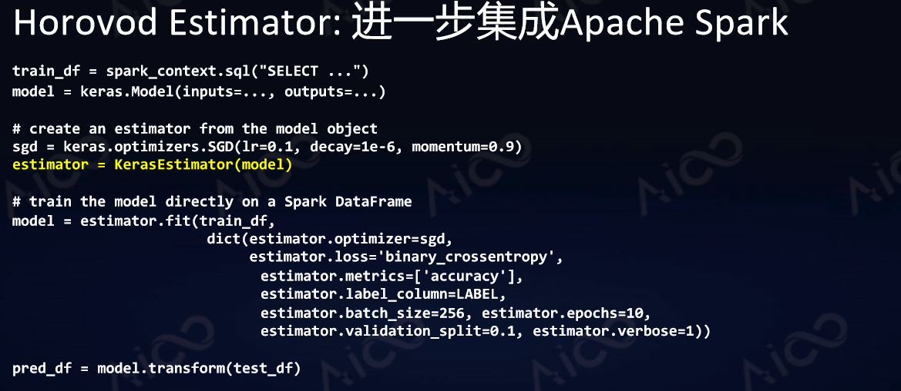

# Horovod基本原理与使用


<!--more-->


> Reference:
>
> https://github.com/horovod/horovod
>
> http://www.dataguru.cn/article-14746-1.html

Distributed training framework for TensorFlow, Keras, PyTorch, and Apache MXNet.


## 1. 分布式深度学习原理

**深度学习训练的算法叫做反向传播**。即通过神经网络得到预测结果，把预测结果跟标注Label进行比对，发现误差；然后得到神经网络里每个神经元权重导数；接着通过算法得到每个神经元导数，再更新神经元的权重以得到更好的神经元网络，周而复始迭代训练，使得误差减少。

神经网络推理能力随着规模、复杂度增加，能力会极大的增强。但从计算能力角度来说又出现了新问题：很多时候大规模神经网络很难在单个/单点计算单元里面运行，这会导致计算很慢，以至无法运行大规模数据。所以人们提出两种深度学习的基本方法以解决这个问题。

### 1.1 深度学习的两种基本方法


#### 1.1.1 模型并行

把复杂的神经网络拆分，分布在计算单元或者GPU里面进行学习，让每个GPU同步进行计算。这个方法通常用在模型比较复杂的情况下。

#### 1.1.2 数据并行

让每个机器里都有一个完整模型，然后把数据切分成n块，把n块分发给每个计算单元，每个计算单元独自计算出自己的梯度。同时每个计算单元的梯度会进行平均、同步，同步后的梯度可以在每个节点独立去让它修正模型，整个过程结束后每个节点会得到同样的模型。这个方法可以让能够处理的数据量增加，变成了原来的n倍。

数据并行原理:


### 1.2 实现数据并行的两种工程方法

#### 1.2.1 参数服务器 (Parameter Server)


在计算单元以外加设新的服务器叫做参数服务器。每次训练的时候每个计算单元把梯度发送给参数服务器，服务器把他们进行汇总计算平均值，把平均值返回到每个计算单元，这样每个计算单元就同步了。


#### 1.2.2 Ring-AllReduce


它是从高性能计算集合通信找到的想法。做法是把每个计算单元构建成一个环，要做梯度平均的时候每个计算单元先把自己梯度切分成N块，然后发送到相邻下一个模块。现在有N个节点，那么N-1次发送后就能实现所有节点掌握所有其他节点的数据。这个方法被证明是一个带宽最优算法。


#### 1.2.3 Parameter Server与Ring-AllReduce对比


参数服务器的做法理论容错性比较强，因为每个节点相互之间没有牵制，互相没有关联，它只是需要跟参数服务器本身进行通信，就可以运作了。缺点是有额外的网络开销，扩展效率会受到影响。

Ring-AllReduce优点非常明显，性能非常好，如果在大规模分布式训练时候资源利用率相当高，网络占用是最优的。它的缺点是在工程上的缺点，容错性较差，很多实现都是用MPI实现（MPI本身并不是为容错设计的，它更偏向于照顾高性能的计算）。


## 2. Horovod

Horovod是基于Ring-AllReduce方法(参考了[百度解决方案](https://github.com/baidu-research/tensorflow-allreduce))的**分布式深度学习插件**，以支持多种流行架构包括TensorFlow、Keras、PyTorch等。这样平台开发者只需要为Horovod进行配置，而不是对每个架构有不同的配置方法。

### 2.1 Horovod特点

- 基于Ring-AllReduce方法
- 一套插件,支持多种流行架构:Tensorflow, Keras, PyTorch, MxNet
  - 通用环境配置,独立于架构
- 容易安装与使用
  - `pip install horovod`
  - 单机程序稍加修改即可实现分布式学习
  - 与Apache Spark集成
- 性能高效
  - 支持MPI, NCCL, RDMA, GPUDirect


### 2.2 Horovod内部架构


### 2.4 Horovod使用方法

单机Keras训练脚本:

1. 用Keras定义它的model
2. X-train、Y-train，定义训练样本和测试样本
3. optimizer，即选定优化器
4. model.compile
5. model. fit


Horovod+Keras分布式训练脚本:

1. 初始化,指定GPU;
2. 定义优化器的时候，优化器重要参数是`学习率(lr)` , `lr * hvd.size();`
3. 使用Horovod的DistributedOptimizer将优化器包裹，抽象了Horovod需要进行的梯度平均的逻辑;
4. 加callback,让Horovod把每次训练的初始状态广播到每个节点，这样保证每个节点从同一个地方开始;
5. epochs平均到每台机器


启动分布式训练:

```shell
# 单机多卡
horovodrun -np 4 -H localhost:4 python train.py

# 多级多卡
horovodrun -np 16 -H server1:4,server2:4,server3:4,server4:4 python train.py
```


### 2.5 高级功能


### 2.6 新功能预览





### 2.7 容器中使用Horovod

#### 2.7.1 docker

> reference:
>
> https://github.com/horovod/horovod
>
> https://hub.docker.com/r/horovod/horovod/tags
>
> 


#### 2.7.2 k8s

> reference:
>
> https://github.com/helm/charts/tree/master/stable/horovod
>
> https://hub.helm.sh/charts/stable/horovod/1.0.0
>
> 
