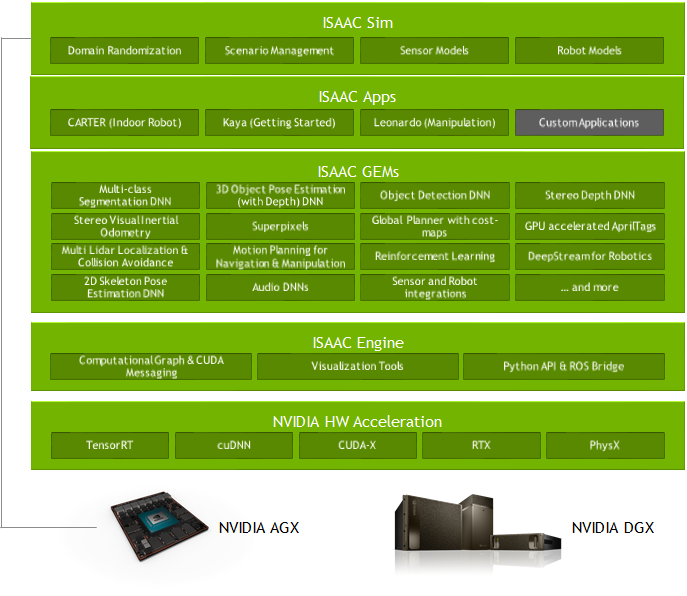

# NVIDIA Isaac SDK


<!--more-->


> 参考:
>
> https://docs.nvidia.com/isaac/isaac/doc/overview.html
>
> https://developer.nvidia.com/isaac-sdk




## 1. Isaac Engine

application framework

Isaac Engine是一个**软件框架**，可轻松构建模块化机器人应用程序。它为智能机器人提供了高性能的数据处理和深度学习。在Isaac机器人引擎上开发的机器人应用程序可以在NVIDIA®Jetson AGX Xavier™和NVIDIA®Jetson Nano™等边缘设备以及具有离散NVIDIA®GPU的工作站（例如T4）上无缝运行。


## 2. Isaac GEMs

packages with high-performance robotics algorithms

GEMs是用于感应，规划或驱动的模块化功能，可以轻松插入机器人应用程序中。例如，开发人员可以添加障碍物检测，立体声深度估计或人类语音识别，以丰富其机器人用例。


## 3. Isaac Apps

reference applications


## 4. Isaac Sim

a powerful simulation platform

Isaac Sim是虚拟机器人实验室和高保真3D世界模拟器，可通过降低成本和风险来加速研究，设计和开发。


## 5. Dev

### 5.1 Setup

> Env:
>
> Ubuntu18.04.1 (Nvidia Driver 440, cuda10.0, GPU算力 >= 3.5)
>
> Nano: Jetpack4.3


[下载](https://developer.nvidia.com/isaac/downloads)Isaac SDK和Isaac Sim, 分别解压到 `~/isaac_sdk` 和 `~/isaac_sim_unity3d`


添加镜像源:

```bash
sudo vi /etc/apt/sources.list
```

```
deb https://mirrors.tuna.tsinghua.edu.cn/ubuntu/ bionic main restricted universe multiverse
# deb-src https://mirrors.tuna.tsinghua.edu.cn/ubuntu/ bionic main restricted universe multiverse
deb https://mirrors.tuna.tsinghua.edu.cn/ubuntu/ bionic-updates main restricted universe multiverse
# deb-src https://mirrors.tuna.tsinghua.edu.cn/ubuntu/ bionic-updates main restricted universe multiverse
ideb https://mirrors.tuna.tsinghua.edu.cn/ubuntu/ bionic-backports main restricted universe multiverse
# deb-src https://mirrors.tuna.tsinghua.edu.cn/ubuntu/ bionic-backports main restricted universe multiverse
deb https://mirrors.tuna.tsinghua.edu.cn/ubuntu/ bionic-security main restricted universe multiverse
# deb-src https://mirrors.tuna.tsinghua.edu.cn/ubuntu/ bionic-security main restricted universe multiverse
```

安装pip3

```bash
curl https://bootstrap.pypa.io/get-pip.py -o get-pip.py
python3 get-pip.py

# 修改为豆瓣源
sudo pip3 config set global.index-url https://pypi.doubanio.com/simple/
```


#### Installing Dependencies on the Desktop

```bash
cd ~/isaac_sdk
engine/build/scripts/install_dependencies.sh
```


Installing Dependencies on Robots:

```bash
cd ~/isaac_sdk
# engine/build/scripts/install_dependencies_jetson.sh -u <jetson_username> -h <jetson_ip>
engine/build/scripts/install_dependencies_jetson.sh -u nona -h 192.168.20.155
```


#### [Installing Bazel](https://docs.bazel.build/versions/master/install-ubuntu.html)

```bash
sudo apt install curl gnupg
curl https://bazel.build/bazel-release.pub.gpg | sudo apt-key add -
echo "deb [arch=amd64] https://storage.googleapis.com/bazel-apt stable jdk1.8" | sudo tee /etc/apt/sources.list.d/bazel.list

sudo apt update && sudo apt install bazel

# Ubuntu 18.04 (LTS) uses OpenJDK 11 by default:
sudo apt install openjdk-11-jdk
```


#### Installing NVIDIA GPU Driver

```bash
sudo add-apt-repository ppa:graphics-drivers/ppa
sudo apt-get update
sudo apt-get install nvidia-driver-440
```


#### Installing [CUDA10.0](https://developer.nvidia.com/cuda-10.0-download-archive?target_os=Linux&target_arch=x86_64&target_distro=Ubuntu&target_version=1804&target_type=runfilelocal) 

```bash
# 下载.run脚本并运行, 注: 只安装cuda tool kit, 不安装driver
wget https://developer.download.nvidia.cn/compute/cuda/10.0/secure/Prod/local_installers/cuda_10.0.130_410.48_linux.run

sudo sh cuda_10.0.130_410.48_linux.run
```

在`vim ~/.bashrc`的最后加上以下配置信息

```
export CUDA_HOME=/usr/local/cuda-10.0
export LD_LIBRARY_PATH=${CUDA_HOME}/lib64
export PATH=${CUDA_HOME}/bin:${PATH}
```

使用命令`source ~/.bashrc`使配置生效


#### Install Unity Editor for Editor Mode

> https://forum.unity.com/threads/unity-hub-v-1-3-2-is-now-available.594139/

```
wget https://public-cdn.cloud.unity3d.com/hub/prod/UnityHub.AppImage
chmod +x UnityHub.AppImage
./UnityHub.AppImage
```

When the Unity Hub application opens, follow these steps to install the Unity Editor:

1. Click the person icon in the upper right and select **Sign in**. Sign in with your Unity ID.
2. Select **Installs** on the left, then select **Add**.
3. In the **Add Unity Version** popup window, install 2019.3.x (no modules are required). The sample project for IsaacSim Unity3D is created with 2019.3.0f6, so any newer 2019.3 version can be used.


### 5.2 运行Isaac SDK示例App

#### 5.2.1  stereo_dummy sample application

```bash
cd ~/isaac_sdk
bazel build //apps/samples/stereo_dummy
bazel run //apps/samples/stereo_dummy
```

应用运行后,可在浏览器打开`http://localhost:3000`


将应用部署运行在Jetson上:

```bash
# 配置desktop免密登录Jetson
ssh-keygen
ssh-copy-id -i ~/.ssh/id_rsa.pub  nona@192.168.20.155

# deploy the package to the robot
cd ~/isaac_sdk
# ./engine/build/deploy.sh --remote_user <username_on_robot> -p //apps/samples/stereo_dummy:stereo_dummy-pkg -d jetpack43 -h <robot_ip>
./engine/build/deploy.sh --remote_user nona -p //apps/samples/stereo_dummy:stereo_dummy-pkg -d jetpack43 -h 192.168.20.155
```

在Jetson上运行 :

```bash
# ssh ROBOTUSER@ROBOTIP
ssh nona@192.168.20.155

# deep为desktop的用户名
cd deploy/deep/stereo_dummy-pkg
./apps/samples/stereo_dummy/stereo_dummy
# 应用运行后浏览器打开192.168.20.155:3000
```

也可以部署到Jetson同时运行App,加 `--run`

```bash
./engine/build/deploy.sh --remote_user nona -p //apps/samples/stereo_dummy:stereo_dummy-pkg -d jetpack43 -h 192.168.20.155 --run
```


#### 5.2.2  v4l2_camera sample application

```bash
bazel build //apps/samples/v4l2_camera
bazel run //apps/samples/v4l2_camera

./engine/build/deploy.sh --remote_user nona -p //apps/samples/v4l2_camera:v4l2_camera-pkg -d jetpack43 -h 192.168.20.155 --run
```


### 5.3 运行Isaac Sim示例App

#### 5.3.1 Play Mode

##### 5.3.1.1 Warehouse Navigation

```bash
# start the simulator with the “small_warehouse” scene
cd ~/isaac_sim_unity3d/builds
./sample.x86_64 --scene small_warehouse -logFile -
```


```bash
# run the Isaac SDK application with the Carter navigation stack
cd ~/isaac_sdk
bazel run //apps/navsim:navsim_navigate
```


