# Spark2环境搭建与使用


<!--more-->

## Spark

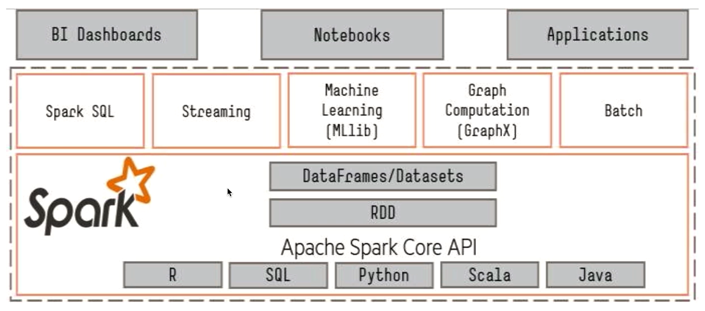


### 1. install

env :	centos7 

#### 1.1 java

卸载centos7自带openjdk,安装oracle的jdk

```sh
sh-4.2$ rpm -qa|grep jdk
java-1.8.0-openjdk-1.8.0.252.b09-2.el7_8.x86_64
java-1.8.0-openjdk-headless-1.8.0.252.b09-2.el7_8.x86_64
copy-jdk-configs-3.3-10.el7_5.noarch

# uninstall
sh-4.2$ sudo rpm -e --nodeps java-1.8.0-openjdk-1.8.0.252.b09-2.el7_8.x86_64
sh-4.2$ sudo rpm -e --nodeps java-1.8.0-openjdk-headless-1.8.0.252.b09-2.el7_8.x86_64

sh-4.2$ rpm -qa|grep jdk
copy-jdk-configs-3.3-10.el7_5.noarch
```


```sh
tar -zxvf jdk-8u251-linux-x64.tar.gz -C ~/app/
```


修改环境变量:

`vim ~/.bash_profile`

```sh
export JAVA_HOME=/home/sunyh/app/jdk1.8.0_251
export PATH=$JAVA_HOME/bin:$PATH
```


```sh
source ~/.bash_profile
```


#### 1.2 scala

spark与scala版本对应参考: https://spark.apache.org/docs/latest/index.html

scala下载: https://www.scala-lang.org/download/2.12.11.html

```sh
tar -zxvf scala-2.11.12.tgz -C ~/app/
```

env: 

```sh
export SCALA_HOME=/home/sunyh/app/scala-2.12.11
export PATH=$SCALA_HOME/bin:$PATH
```


https://downloads.lightbend.com/scala/2.11.12/scala-2.11.12.tgz


#### 1.3 hadoop

cdh版本: http://archive.cloudera.com/cdh5/cdh/5/

http://archive.cloudera.com/cdh5/cdh/5/hadoop-2.6.0-cdh5.16.2.tar.gz

```sh
tar -zxvf hadoop-2.6.0-cdh5.16.2.tar.gz -C ~/app/
```

env:

```sh
export HADOOP_HOME=/home/sunyh/app/hadoop-2.6.0-cdh5.16.2
export PATH=$HADOOP_HOME/bin:$PATH
```


配置修改:

```sh
cd /home/sunyh/app/hadoop-2.6.0-cdh5.16.2/etc/hadoop
```

- hadoop-env.sh

  修改JAVA_HOME

- core-site.xml

  ```xml
  <configuration>
    <property>
      <name>fs.defaultFS</name>
      <value>hdfs://master01:8020</value>
    </property>
    <property>
      <name>hadoop.tmp.dir</name>
    <value>/home/sunyh/app/tmp</value>
    </property>
</configuration>
  ```
  
  
  
- hdfs-site.xml

  ```xml
  <configuration>
    <property>
      <name>dfs.replication</name>
      <value>1</value>
    </property>
  </configuration>
  ```
  
  
  
- mapred-site.xml.template

  ```bash
  cp mapred-site.xml.template mapred-site.xml
  ```

  

  ```xml
  <configuration>
    <property>
      <name>mapreduce.framework.name</name>
      <value>yarn</value>
    </property>
  </configuration>
  ```

  

- yarn-site.xml

  ```xml
  <configuration>
    <property>
      <name>yarn.nodemanager.aux-serivices</name>
      <value>mapreduce_shuffle</value>
    </property>
  </configuration>
  ```


格式化:

```sh
cd /home/sunyh/app/hadoop-2.6.0-cdh5.16.2/bin

./hdfs namenode -formate
```

启动hdfs:

```sh
cd /home/sunyh/app/hadoop-2.6.0-cdh5.16.2/sbin

./start-dfs.sh
```

查看启动状态:

```sh
jps
```

测试:

```sh
hadoop fs -ls /

hadoop fs -mkdir /test

cd /home/sunyh/app/hadoop-2.6.0-cdh5.16.2
hadoop fs -put README.txt /test/
hadoop fs -ls /test
hadoop fs -text /test/README.txt
```

web: 	master01:50070

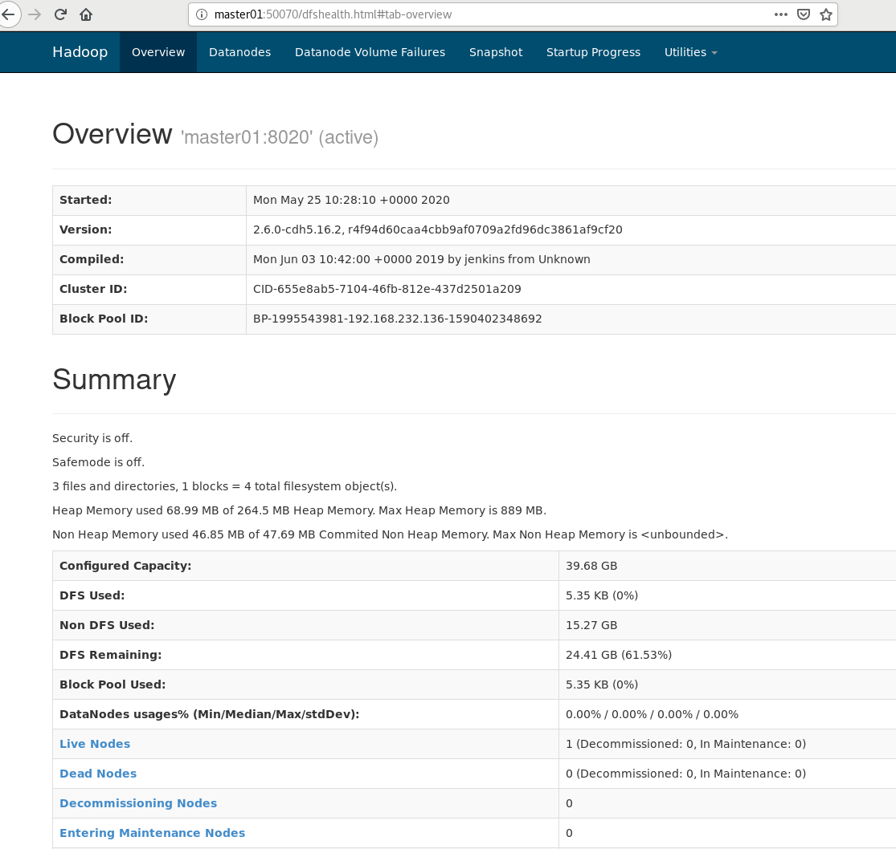

启动YARN:

```sh
cd /home/sunyh/app/hadoop-2.6.0-cdh5.16.2/sbin

./start-yarn.sh
```

web: 	master01:8088

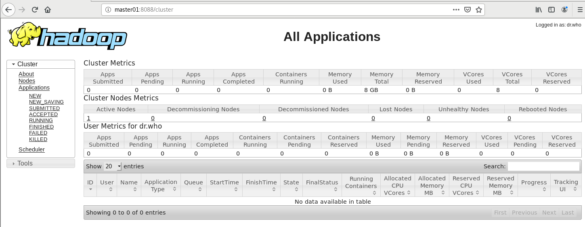


#### 1.4 maven

https://maven.apache.org/download.cgi

https://spark.apache.org/docs/latest/building-spark.html

```bash
tar -zxvf apache-maven-3.5.4-bin.tar.gz -C ~/app/
```

env:

```bash
export MAVEN_HOME=/home/sunyh/app/apache-maven-3.5.4
export PATH=$MAVEN_HOME/bin:$PATH
```


#### 1.5 spark

##### 1.5.1 源码编译

编译没成功

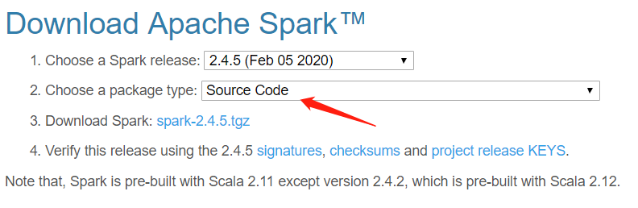

package type选择source type.

https://spark.apache.org/docs/latest/building-spark.html

```bash
tar -zxvf spark-2.4.5.tgzbash
```

```bash
export MAVEN_OPTS="-Xmx2g -XX:ReservedCodeCacheSize=1g"
```

```bash
cd /home/sunyh/software/spark-2.4.5
./dev/make-distribution.sh --name 2.6.0-cdh5.16.2 --tgz -Phadoop-2.6 -Phive -Phive-thriftserver -Pyarn -Dhadoop.version=2.6.0-cdh5.16.2
```


##### 1.5.2 tar包解压

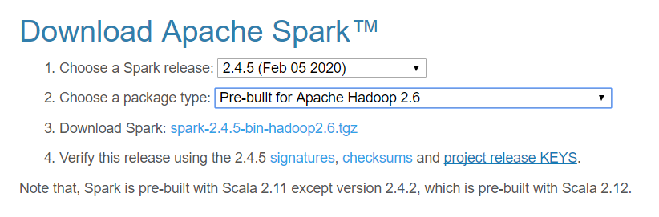

```bash
tar -zxvf spark-2.4.5-bin-hadoop2.6.tgz -C ~/app/
```

```sh
export SPARK_HOME=/home/sunyh/app/spark-2.4.5-bin-hadoop2.6
export PATH=$SPARK_HOME/bin:$PATH
```


### 2. Spark RDD

Resilient Distributed Dataset

https://github.com/apache/spark/blob/master/core/src/main/scala/org/apache/spark/rdd/RDD.scala

#### RDD编程

- [Parallelized Collections](https://spark.apache.org/docs/latest/rdd-programming-guide.html#parallelized-collections)

- [External Datasets](https://spark.apache.org/docs/latest/rdd-programming-guide.html#external-datasets)

  PySpark can create distributed datasets from any storage source supported by Hadoop, including your local file system, HDFS, Cassandra, HBase, [Amazon S3](http://wiki.apache.org/hadoop/AmazonS3), etc. Spark supports text files, [SequenceFiles](http://hadoop.apache.org/common/docs/current/api/org/apache/hadoop/mapred/SequenceFileInputFormat.html), and any other Hadoop [InputFormat](http://hadoop.apache.org/docs/stable/api/org/apache/hadoop/mapred/InputFormat.html).

- [RDD Operations](https://spark.apache.org/docs/latest/rdd-programming-guide.html#rdd-operations)

  - *transformations*
  - *actions*

- [RDD Persistence](https://spark.apache.org/docs/latest/rdd-programming-guide.html#rdd-persistence)


### 3. PySpark

PyCharm环境配置(local 本地测试):

- python intercepter 

- python structure

  添加/home/sunyh/app/spark-2.4.5-bin-hadoop2.6/python/lib下的两个zip包

  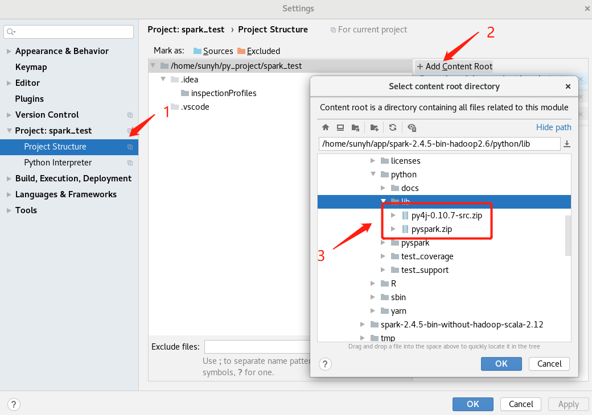

- Run Configurations

  env 添加PYTHONPATH

  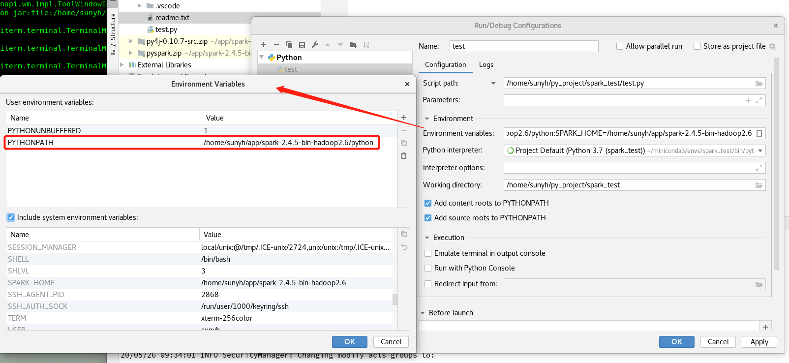

测试:

```python
from pyspark import SparkConf,SparkContext
 
if __name__ == "__main__":
    # conf = SparkConf().setMaster("local[2]").setAppName("spark0526")
    conf = SparkConf()
    sc = SparkContext(conf=conf)
    data = [1, 2, 3, 4, 5]
    distData = sc.parallelize(data)
    print(distData.collect())
    sc.stop()
```

提交pyspark应用程序:

参考:https://spark.apache.org/docs/latest/submitting-applications.html

```bash
spark-submit --master local[2] --name spark0526 /home/sunyh/py_project/spark_test/test.py
```

```sh
spark-submit --help
```

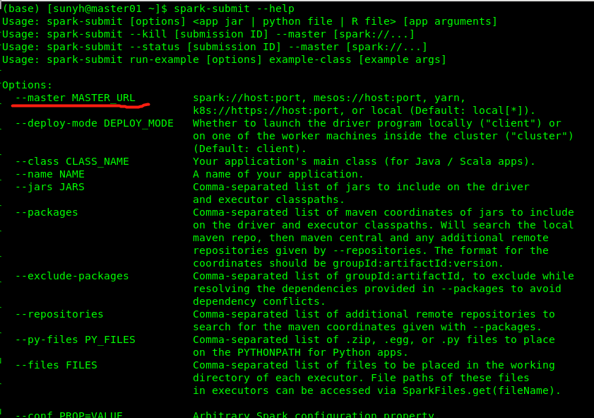


### 4. Spark运行模式

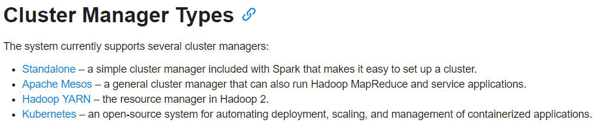

```python
# spark_op.py  统计单词个数

import sys

from pyspark import SparkConf, SparkContext

if __name__ == "__main__":
    if len(sys.argv) != 2:
        print("Usage: wordcount <input>", file=sys.stderr)
    conf = SparkConf()
    sc = SparkContext(conf=conf)

    def print_result():
        counts = sc.textFile(sys.argv[1]) \
            .flatMap(lambda line: line.split(' ')) \
            .map(lambda x: (x, 1)) \
            .reduceByKey(lambda a, b: a + b)
        output = counts.collect()
        for (word, count) in output:
            print('%s: %i' % (word, count))

    print_result()

    sc.stop()
```

hello.txt

```
hello world
hello spark
welcome to beijing
```


#### 4.1 Local

```sh
# 单文件
spark-submit --master local[2] --name spark_local \
/home/sunyh/py_project/spark_test/spark_op.py \
file:///home/sunyh/py_project/spark_test/data/hello.txt
	
# 多文件
spark-submit --master local[2] --name spark_local \
/home/sunyh/py_project/spark_test/spark_op.py \
file:///home/sunyh/py_project/spark_test/data
```

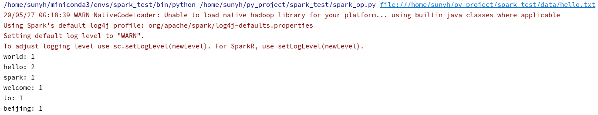

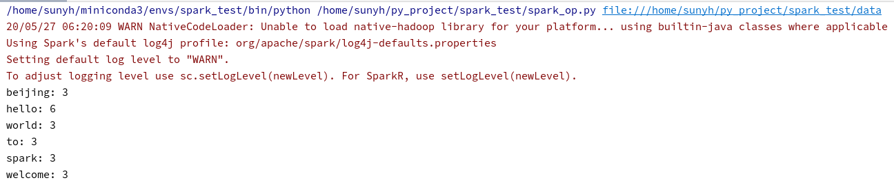


#### 4.2 Standalone

https://spark.apache.org/docs/latest/spark-standalone.html

修改配置文件:

```sh
# cd $SPARK_HOME/conf
cd /home/sunyh/app/spark-2.4.5-bin-hadoop2.6/conf
cp slaves.template slaves

# 修改spark slave节点名
vim slaves 
```

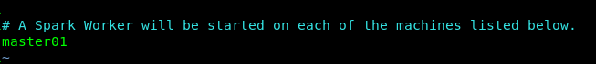

如果多台机器,每台机器都在相同路径下部署spark;

```sh
cd $SPARK_HOME/conf
cp spark-env.sh.template spark-env.sh
vim spark-env.sh
# 添加java环境变量  JAVA_HOME=/home/sunyh/app/jdk1.8.0_251
```

启动spark:

```sh
cd $SPARK_HOME/sbin
# 可以使用start-master.sh / start-slave.sh 分别启动
./start-all.sh
```

检查是否启动成功:  *jps*

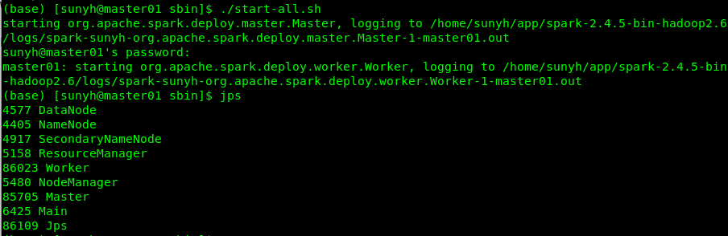

> HDFS:	NameNode	/	DataNode
>
> YARN:	ResourceManager	/	NodeManager
>
> Spark Standalone:	Master	/	Worker


启动日志:

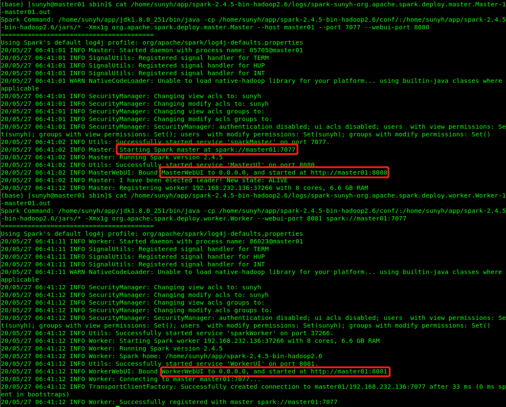

测试:

```sh
# 单文件
spark-submit --master spark://master01:7077 --name spark_standalone \
/home/sunyh/py_project/spark_test/spark_op.py \
file:///home/sunyh/py_project/spark_test/data/hello.txt
	
# 多文件
spark-submit --master spark://master01:7077 --name spark_standalone \
/home/sunyh/py_project/spark_test/spark_op.py \
file:///home/sunyh/py_project/spark_test/data
```

使用standalone模式而且节点数大于1,使用本地文件测试,必须保证每个节点都有测试文件.

```sh
# 测试文件上传到hdfs
hadoop fs -put /home/sunyh/py_project/spark_test/data/hello.txt /test.txt
# 查看文件
hadoop fs -text /test.txt
# 测试
spark-submit --master spark://master01:7077 --name spark_standalone \
/home/sunyh/py_project/spark_test/spark_op.py \
hdfs://master01:8020/test.txt \
hdfs://master01:8020/test/output	#输出文件
```


#### 4.3 Yarn

https://spark.apache.org/docs/latest/running-on-yarn.html

spark仅作为客户端,然后把作业提交到yarn执行;

yarn vs standalone:

​	yarn: 只需一个spark节点,不需要spark集群(不用启动master,worker)

​	standalone: spark集群每个节点都需要部署spark,然后启动spark集群(master,worker)


yarn模式配置:

```sh
cd $SPARK_HOME/conf
vim spark-env.sh
# 添加HADOOP_CONF_DIR环境变量  HADOOP_CONF_DIR=/home/sunyh/app/hadoop-2.6.0-cdh5.16.2/etc/hadoop
```

测试:

```sh
spark-submit --master yarn --name spark_yarn \
/home/sunyh/py_project/spark_test/spark_op.py \
hdfs://master01:8020/test.txt \
hdfs://master01:8020/test/output	#输出文件
```


yarn部署模式(deploy-mode): `client`(默认)和`cluster`

​	client: 提交作业的进程不能停止

​	cluster: 提交完作业,提交作业端断开,所以pyspark/spark-shell/spark-sql等交互式运行程序不能用cluster模式

There are two deploy modes that can be used to launch Spark applications on YARN. In `cluster` mode, the Spark driver runs inside an **application master process** which is managed by YARN on the cluster, and the client can go away after initiating the application. In `client` mode, the driver runs in the **client process**, and the application master is only used for requesting resources from YARN.

```sh
# cluster
spark-submit --master yarn --name spark_yarn_cluster --deploy-mode cluster \
/home/sunyh/py_project/spark_test/spark_op.py \
hdfs://master01:8020/test.txt \
hdfs://master01:8020/test/output	#输出文件
```


查看yarn application 日志:

```sh
yarn logs --applicationId <app ID>
```

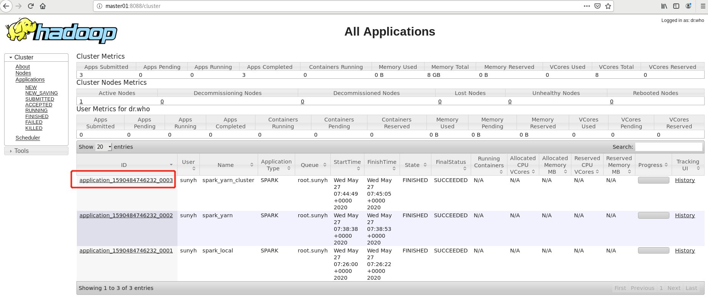

```bash
yarn logs --applicationId application_1590484746232_0003
```

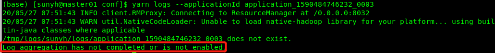

Q:	Log aggregation has not completed or is not enabled.(日志聚合功能没开启)

A:	修改yarn-site.xml

```xml
<property>
  <name>yarn.log-aggregation-enable</name>
  <value>true</value>
</property>
<property>
  <name>yarn.nodemanager.log-aggregation.roll-monitoring-interval-seconds</name>
  <value>3600</value>
</property>
<property>
  <name>yarn.nodemanager.remote-app-log-dir</name>
  <value>/tmp/logs</value>
</property>
```

重启yarn,测试

```
yarn logs --applicationId application_1590566719320_0001
```

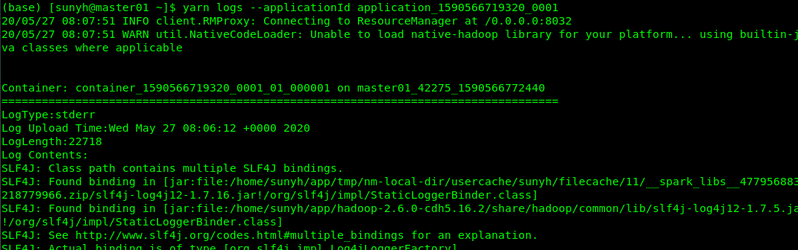


### 5. Monitoring

https://spark.apache.org/docs/latest/monitoring.html

配置修改:

```sh
cd $SPARK_HOME/conf
cp spark-defaults.conf.template spark-defaults.conf
vim spark-defaults.conf
# 设置spark.eventLog.enabled和spark.eventLog.dir
```

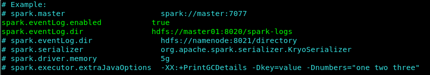

```bash
vim spark-env.sh
# 修改SPARK_HISTORY_OPTS
# SPARK_HISTORY_OPTS="-Dspark.history.fs.logDirectory=hdfs://master01:8020/spark-logs"
```

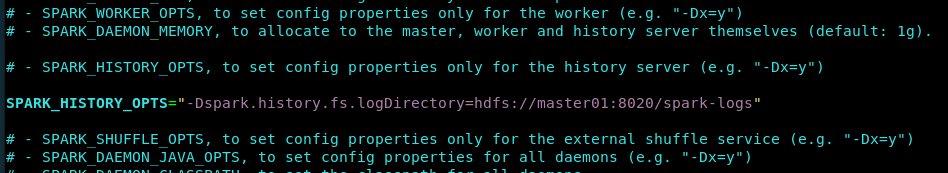

启动history server:

```sh
cd $SPARK_HOME/sbin
./start-history-server.sh
```

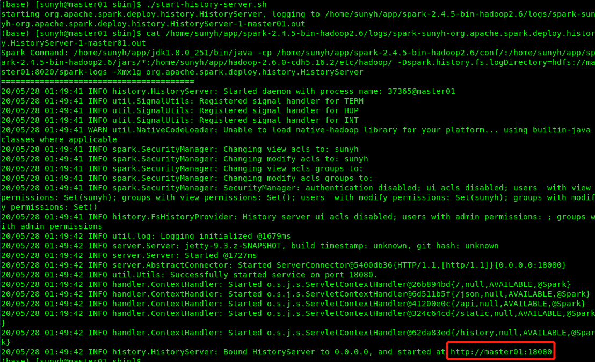

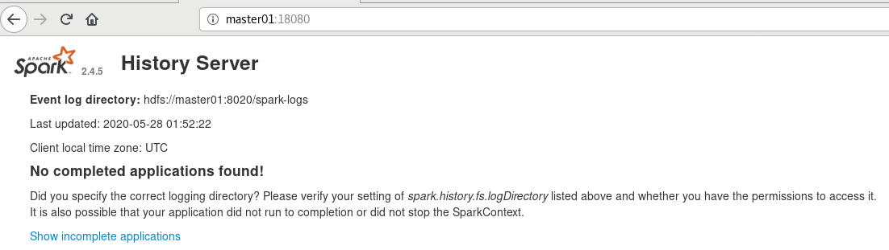

不同模式提交任务查看history server:

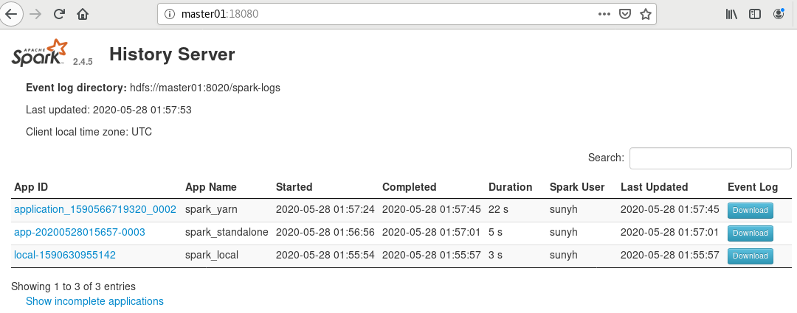

任务详细信息:

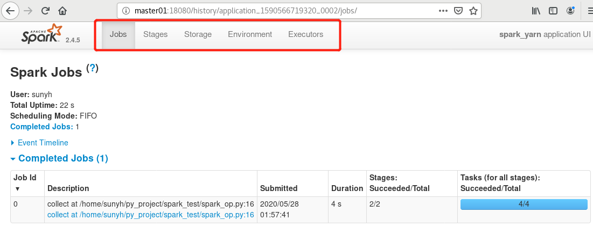

任务日志以json保存在配置的hdfs:

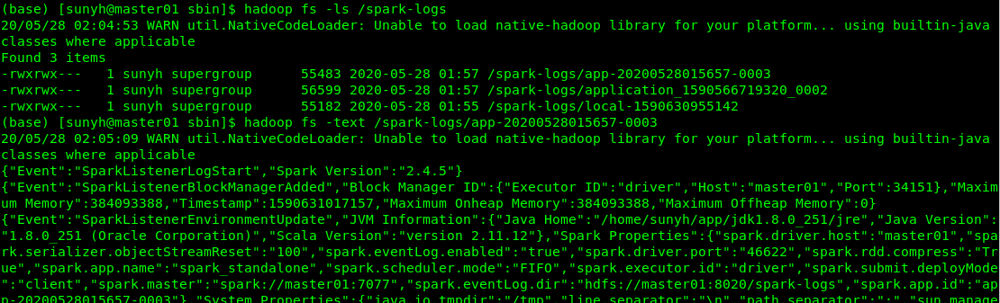


### 6. Spark调优

https://spark.apache.org/docs/latest/tuning.html

- Data Serialization

- Memory Tuning

- Broadcasting Large Variables

  https://spark.apache.org/docs/latest/rdd-programming-guide.html#broadcast-variables

- Data Locality


### 7. Spark SQL

> https://spark.apache.org/sql/
>
> https://spark.apache.org/docs/latest/sql-programming-guide.html

Spark SQL is Apache Spark's module for working with structured data.


Spark SQL提供的操作数据的方式: SQL, DataFrame API, Dataset API(暂时不支持python)

- Dataset 

  A Dataset is a distributed collection of data.

  [[Row]]的数据集

- DataFrame 

  A DataFrame is a *Dataset* organized into named columns.  

  以列(列名,列类型,列值)的的形式构成的分布式数据集.

  DataFrame = RDD[Row] + shcema


测试文件: *spark_sql_op.py*

```python
from pyspark.sql import SparkSession, Row
# Import data types
from pyspark.sql.types import *

def base_test(spark):
    # spark is an existing SparkSession
    df = spark.read.json("file:///home/sunyh/app/spark-2.4.5-bin-hadoop2.6/examples/src/main/resources/people.json")
    # Displays the content of the DataFrame to stdout
    df.show()
    # +----+-------+
    # | age|   name|
    # +----+-------+
    # |null|Michael|
    # |  30|   Andy|
    # |  19| Justin|
    # +----+-------+

    # spark, df are from the previous example
    # Print the schema in a tree format
    df.printSchema()
    # root
    # |-- age: long (nullable = true)
    # |-- name: string (nullable = true)

    # Select only the "name" column
    df.select("name").show()
    # +-------+
    # |   name|
    # +-------+
    # |Michael|
    # |   Andy|
    # | Justin|
    # +-------+

    # Select everybody, but increment the age by 1
    df.select(df['name'], df['age'] + 1).show()
    # +-------+---------+
    # |   name|(age + 1)|
    # +-------+---------+
    # |Michael|     null|
    # |   Andy|       31|
    # | Justin|       20|
    # +-------+---------+

    # Select people older than 21
    df.filter(df['age'] > 21).show()
    # +---+----+
    # |age|name|
    # +---+----+
    # | 30|Andy|
    # +---+----+

    # Count people by age
    df.groupBy("age").count().show()
    # +----+-----+
    # | age|count|
    # +----+-----+
    # |  19|    1|
    # |null|    1|
    # |  30|    1|
    # +----+-----+


def schema_inference_example(spark):
    """
    RDD --> DataFrame
    自动推导Schema
    :param spark:
    """
    sc = spark.sparkContext

    # Load a text file and convert each line to a Row.
    lines = sc.textFile("file:///home/sunyh/app/spark-2.4.5-bin-hadoop2.6/examples/src/main/resources/people.txt")
    parts = lines.map(lambda l: l.split(","))
    people = parts.map(lambda p: Row(name=p[0], age=int(p[1])))

    # Infer the schema, and register the DataFrame as a table.
    schemaPeople = spark.createDataFrame(people)
    schemaPeople.printSchema()
    schemaPeople.createOrReplaceTempView("people")

    # SQL can be run over DataFrames that have been registered as a table.
    teenagers = spark.sql("SELECT name FROM people WHERE age >= 13 AND age <= 19")

    # The results of SQL queries are Dataframe objects.
    # rdd returns the content as an :class:`pyspark.RDD` of :class:`Row`.
    teenNames = teenagers.rdd.map(lambda p: "Name: " + p.name).collect()
    for name in teenNames:
        print(name)
    # Name: Justin


def schema_programmatic_example(spark):
    """
    RDD --> DataFrame
    编程实现Schema
    :param spark:
    """
    sc = spark.sparkContext

    # Load a text file and convert each line to a Row.
    lines = sc.textFile("file:///home/sunyh/app/spark-2.4.5-bin-hadoop2.6/examples/src/main/resources/people.txt")
    parts = lines.map(lambda l: l.split(","))
    # Each line is converted to a tuple.
    people = parts.map(lambda p: (p[0], p[1].strip()))

    # The schema is encoded in a string.
    schemaString = "name age"

    fields = [StructField(field_name, StringType(), True) for field_name in schemaString.split()]
    schema = StructType(fields)

    # Apply the schema to the RDD.
    schemaPeople = spark.createDataFrame(people, schema)

    # Creates a temporary view using the DataFrame
    schemaPeople.createOrReplaceTempView("people")

    # SQL can be run over DataFrames that have been registered as a table.
    results = spark.sql("SELECT name FROM people")

    results.show()
    # +-------+
    # |   name|
    # +-------+
    # |Michael|
    # |   Andy|
    # | Justin|
    # +-------+


if __name__ == '__main__':
    spark = SparkSession \
        .builder \
        .appName("Python Spark SQL basic example") \
        .config("spark.some.config.option", "some-value") \
        .getOrCreate()

    # base_test(spark=spark)
    # schema_inference_example(spark)
    schema_programmatic_example(spark)

    spark.stop()
```


```sh
spark-submit --master local[2] --name spark_local \
/home/sunyh/py_project/spark_test/spark_sql_op.py
```


### 8. Spark Streaming

> https://spark.apache.org/streaming/
>
> https://spark.apache.org/docs/latest/streaming-programming-guide.html

Spark Streaming is an extension of the core Spark API that enables scalable, high-throughput, fault-tolerant stream processing of live data streams. 


常用实时流处理框架:

- Storm: 真正实时流处理
- Spark Streaming: 不是真正的实时流处理,而是mini batch操作
- Flink
- Kafka Stream


[DStream](https://spark.apache.org/docs/latest/streaming-programming-guide.html#discretized-streams-dstreams)

Spark Streaming provides a high-level abstraction called *discretized stream* or *DStream*, which represents a continuous stream of data.

Internally, a DStream is represented as a sequence of [RDDs](https://spark.apache.org/docs/latest/api/scala/index.html#org.apache.spark.rdd.RDD).


https://github.com/apache/spark/blob/v2.4.5/examples/src/main/python/streaming/network_wordcount.py

```sh
nc -lk 9999

cd $SPARK_HOME
./bin/spark-submit examples/src/main/python/streaming/network_wordcount.py localhost 9999
```


### 9. MLlib

> https://spark.apache.org/mllib/
>
> https://spark.apache.org/docs/latest/ml-guide.html

- spark.ml --> DataFrame-based API
- spark.mllib --> RDD-based API


### 10. GraphX

> https://spark.apache.org/graphx/
>
> https://spark.apache.org/docs/latest/graphx-programming-guide.html


## Spark3

> 参考:
>
> https://spark.apache.org/docs/3.0.0-preview2/index.html
>
> https://www.nvidia.com/en-us/deep-learning-ai/solutions/data-science/apache-spark-3/
>
> https://github.com/rapidsai/spark-examples


run a [sample](https://github.com/rapidsai/spark-examples/blob/support-spark3.0/getting-started-guides/on-prem-cluster/yarn-python.md#get-started-with-xgboost4j-spark-on-apache-hadoop-yarn) Apache Spark Python application that runs on NVIDIA GPUs


